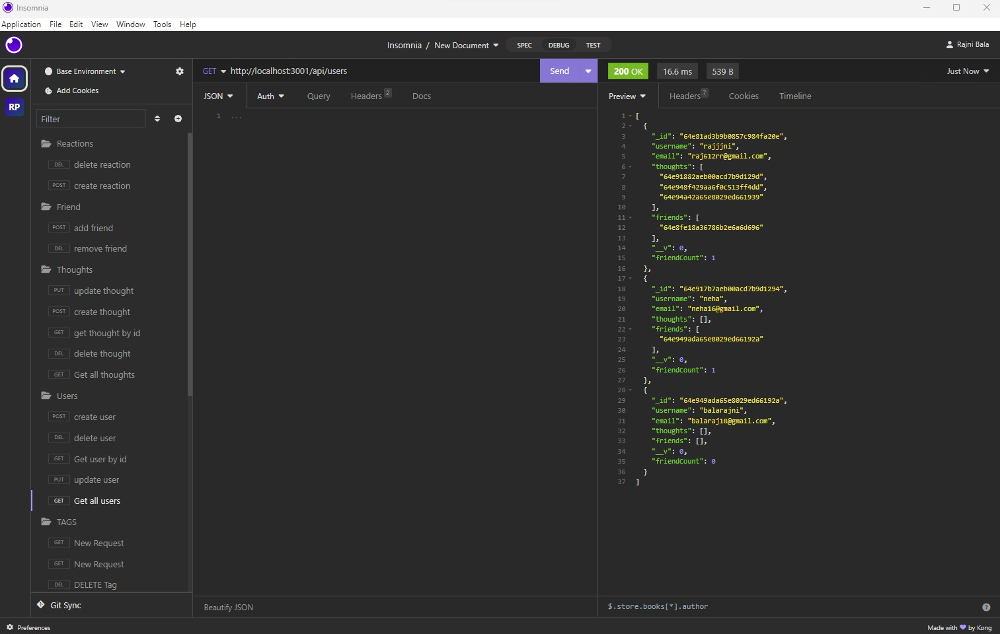
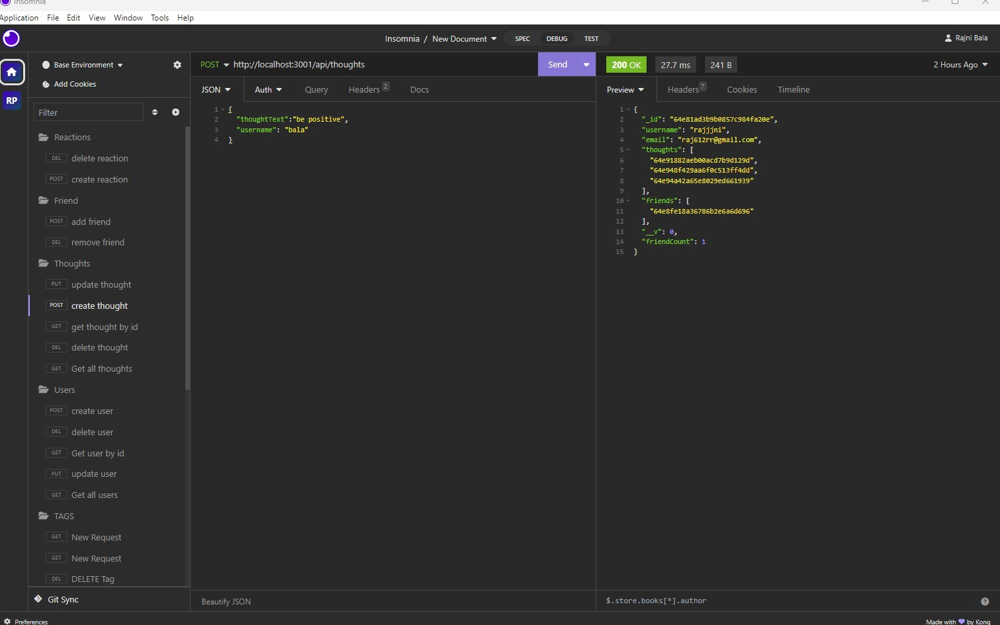
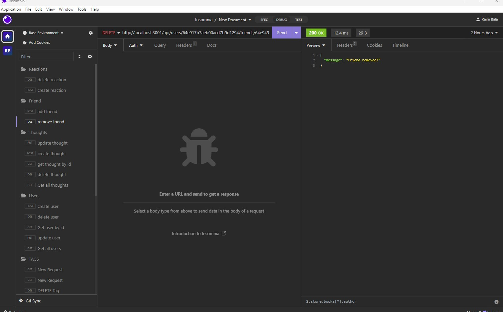

# 18 NoSQL: Social Network API

## Description

Build an API for a social network web application where users can share their thoughts, react to friends’ thoughts, and create a friend list. 

## Table of Contents

- [User Story](#user-story)
- [Acceptance Criteria](#acceptance-criteria)
- [License](#license)
- [Installation](#installation)
- [Instructions](#instructions)
- [Contributing](#contributing)
- [Questions](#questions)

## User Story

```md
AS A social media startup
I WANT an API for my social network that uses a NoSQL database
SO THAT my website can handle large amounts of unstructured data
```

## Acceptance Criteria

```md
GIVEN a social network API
WHEN I enter the command to invoke the application
THEN my server is started and the Mongoose models are synced to the MongoDB database
WHEN I open API GET routes in Insomnia for users and thoughts
THEN the data for each of these routes is displayed in a formatted JSON
WHEN I test API POST, PUT, and DELETE routes in Insomnia
THEN I am able to successfully create, update, and delete users and thoughts in my database
WHEN I test API POST and DELETE routes in Insomnia
THEN I am able to successfully create and delete reactions to thoughts and add and remove friends to a user’s friend list
```

## License 
MIT License

## Installation
1. Clone the repository
2. Install the following: 
- npm init
- npm install
- [express](https://www.npmjs.com/package/express)
- [mongoose](https://www.npmjs.com/package/mongoose)
- [moment](https://www.npmjs.com/package/moment)

## Instructions
💻   
Run the following command at the terminal:

`npm start` <br>
Access API routes with Insomnia, Postman, or other REST API testing client.<br>

### User

- Get all users: GET /api/users
- Create a user: POST /api/users
- Get user by ID: GET /api/users/:id
- Update a user: PUT /api/users/:id
- Delete a user: DELETE /api/users/:id
- Add a friend: PUT /api/users/:userId/friends/:friendId
- Delete a friend: DELETE /api/users/:userId/friends/:friendId

### Thought

- Get all thoughts: GET /api/thoughts
- Create a thought: POST /api/thoughts
- Get thought by ID: GET /api/thoughts/:thoughtId
-Update a thought: PUT /api/thoughts/:thoughtId
- Delete a thought: DELETE /api/thoughts/:thoughtId

### Reaction

- Add a reaction: PUT /api/thoughts/:thoughtId/reactions
- Delete a reaction: DELETE /api/thoughts/:thoughtId/reactions/:reaCtionId


## Contributing
Rajni bala : (https://github.com/rbala16)

## Questions
✉️ Contact me with any questions: [Email:]bala12rajni@gmail.com , [Github](https://github.com/rbala16)<br />

## Mock Up

The following animations show examples of the application's API routes being tested in Insomnia.

The following animation shows GET routes to return all users  being tested in Insomnia:



The following animation shows the  PUT routes for thought being tested in Insomnia:



The following animation shows the DELETE routes for remove friend being tested in Insomnia:



In addition to this, your walkthrough video should show the GET,POST, PUT, DELETE routes for thoughts,users and also POST ,DELETE Routes for friends and reaction  being tested in Insomnia.Link is mentioned below:<br>
https://drive.google.com/file/d/1XR8-a--OWYhc7abfsrOWC1L88RUn9njs/view


## Important Link

You are required to submit BOTH of the following for review:

* A walkthrough video demonstrating the functionality of the application and all of the acceptance criteria being met.<br>
https://drive.google.com/file/d/1XR8-a--OWYhc7abfsrOWC1L88RUn9njs/view

* The URL of the GitHub repository. Give the repository a unique name and include a README describing the project.<br>
https://github.com/rbala16/social-network-api_rb
---
© 2023 edX Boot Camps LLC. Confidential and Proprietary. All Rights Reserved.
